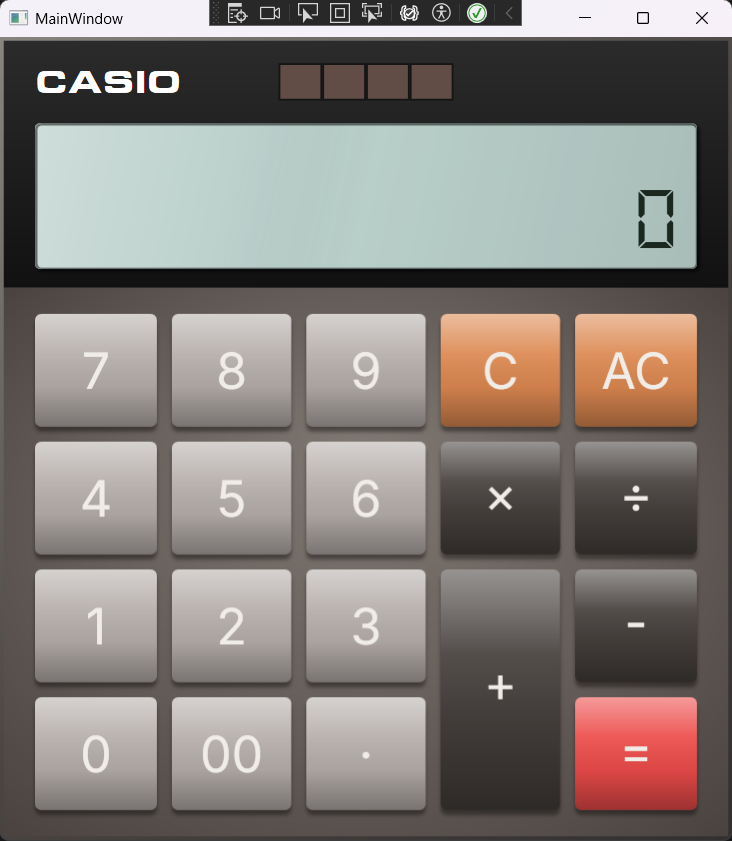
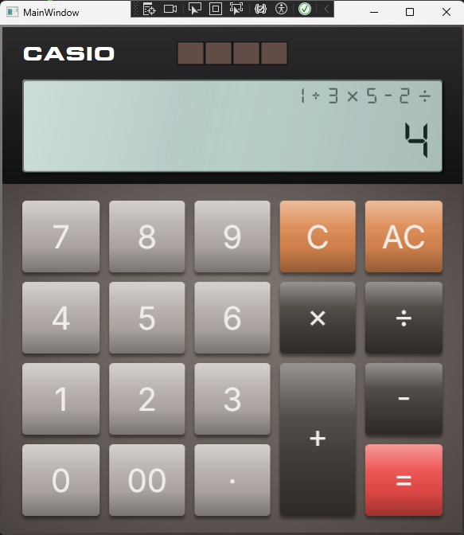
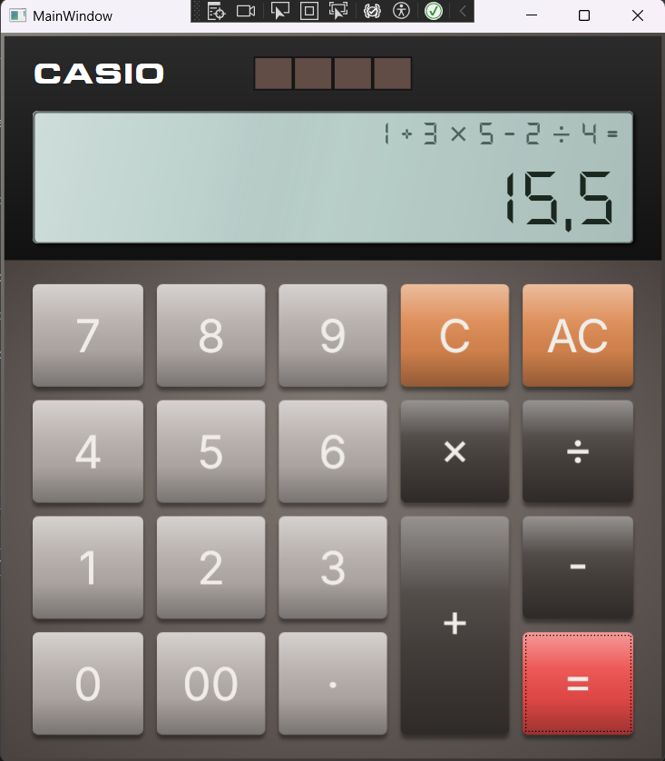
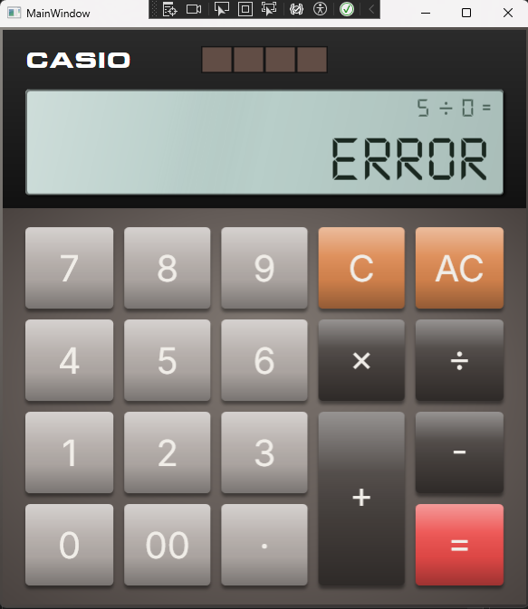

# 🧮 PAC4 — Calculadora

[](https://opensource.org/licenses/MIT)
[](https://dotnet.microsoft.com/)
[](https://learn.microsoft.com/dotnet/desktop/wpf/)
[](https://learn.microsoft.com/dotnet/csharp/)

## 📖 Descripció

Aplicació d'escriptori desenvolupada amb WPF i .NET 8 (C#) que simula el comportament de les operacions bàsiques d'una aplicació calculadora de Windows i el disseny d'una calculadora clàssica d'estil Casio.
Implementa un avaluador matemàtic basat en una llista de tokens que respecta la prioritat operativa (multiplicacions i divisions resoltes abans que sumes i restes), una línia d'expressió en temps real, i una gestiona diversos errors com la divisió per zero.

## 👤 Autoria i llicència

- **Autor:** Marc Codina Llonch
- **Assignatura:** M0488 — Desenvolupament d'Interfícies
- **Curs:** 1r DAM — Centre Teknós (UVIC-UCC)
- **Llicència:** Distribuït sota la [Llicència MIT](https://opensource.org/licenses/MIT)

## 📚 Índex

1. [Requisits del sistema](#️-requisits-del-sistema)
2. [Funcionalitats principals](#-funcionalitats-principals)
3. [Guia d'instal·lació](#-guia-dinstallació)
4. [Guia d'ús](#-guia-dús)
5. [Exemples d'ús](#-exemples-dús)
6. [Conclusions i reflexions](#-conclusions-i-reflexions)

## ⚙️ Requisits del sistema

| Requisit | Detall |
|---|---|
| Sistema operatiu | Windows 10 o superior |
| Entorn d'execució | [.NET 8 Desktop Runtime](https://dotnet.microsoft.com/en-us/download/dotnet/8.0) |
| Entorn de desenvolupament | Visual Studio 2022 (per compilar) |

## ✨ Funcionalitats principals

- **Interfície visual treballada:** Disseny responsive amb Grid, degradats, ombres (DropShadowEffect), efecte 3D als botons i tipografies personalitzades (DS-Digital, Eurostile Extended).
- **Doble línia de pantalla:** Línia d'expressió en temps real (estil Windows Calculator) + número principal amb escala automàtica via ViewBox.
- **Prioritat operativa:** L'avaluador resol × i ÷ abans que + i - mitjançant un algorisme de dos passos lineal.
- **Operacions encadenades:** Permet expressions llargues del tipus 1 + 3 × 5 - 2 ÷ 4 = i obtenir el resultat correcte.
- **Gestió d'errors:** Divisió per zero detectada i mostrada com a Error, conservant l'expressió que l'ha causat a la línia d'historial. També detecta seqüències invàlides com 5 + = o 5 × ÷ 3.
- **C i AC diferenciats:** C esborra l'última entrada conservant l'operació. AC fa un reinici complet.
- **Botó 00:** Afegeix doble zero amb validació per evitar formats invàlids com 007.
- **Compatibilitat regional:** Ús de CultureInfo.InvariantCulture per garantir el comportament correcte dels decimals en qualsevol configuració regional.

## 🚀 Guia d'instal·lació

1. **Clonar el repositori:**
   ```bash
   git clone https://github.com/MarcCodinaLlonch/PAC4-Calculadora.git
   ```
2. **Obrir la solució:** Obre el fitxer `PAC4-Calculadora.sln` amb **Visual Studio 2022**.
3. **Compilar i executar:** Prem `F5` o fes clic a **Inicia** per compilar i llançar l'aplicació.

> **Nota:** No cal instal·lar res addicional. Les tipografies estan incloses com a recurs dins del projecte (`Assets/Fonts/`).

## 📖 Guia d'ús

| Acció | Com fer-la |
|---|---|
| Introduir un número | Premer els botons numèrics (0-9) |
| Afegir decimal | Botó `.` (punt mig) |
| Seleccionar operació | Premer `+`, `-`, `×` o `÷` |
| Canviar d'operador | Prémer un operador diferent sense escriure cap número nou |
| Obtenir el resultat | Prémer `=` |
| Esborrar l'entrada actual | Botó `C` (conserva l'expressió acumulada) |
| Reiniciar tot | Botó `AC` |

## 💡 Exemples d'ús
 
### Calculadora en repòs
 

 
### Operació encadenada en curs
 
L'expressió acumulada es mostra en temps real a la línia superior de la pantalla.
 

 
### Resultat amb prioritat operativa
 
Expressió: `1 + 3 × 5 - 2 ÷ 4`
 
L'avaluador resol primer `3 × 5 = 15` i `2 ÷ 4 = 0,5`, i finalment `1 + 15 - 0,5 = **15,5**`.
 

 
### Error: Divisió per zero
 
Quan es detecta una divisió per zero, la pantalla mostra `Error` i la línia d'historial conserva l'expressió que l'ha causat perquè l'usuari pugui identificar el problema.
 


## 🔍 Conclusions i reflexions
 
### La separació d'estat és la clau del comportament correcte
 
Un dels reptes més interessants d'aquesta PAC ha estat dissenyar bé l'estat intern de la calculadora. En una primera aproximació, podria semblar suficient tenir un únic número en pantalla i un operador pendent. Però en el moment en què s'han d'implementar operacions encadenades com `1 + 3 × 5 - 2 ÷ 4`, cal una estructura capaç de representar tota l'expressió.
 
La solució escollida amb `_tokens` (la llista completa de l'expressió), `_entradaActual` (el número que s'està teclejant en aquest moment) i `_nouNumero` (el flag que controla si el pròxim dígit comença un número nou o continua l'actual) fa que cada variable tingui una funció molt clara i separada. Aquesta separació és el que fa possible que `C` i `AC` tinguin comportaments netament diferents: `C` afecta únicament `_entradaActual` i `_nouNumero`, mentre que `AC` buida tot l'estat. Sense aquesta separació, implementar el `C` sense perdre l'expressió acumulada hauria estat més complex.
 
### L'algorisme de dos passos com a implementació de la precedència

Per respectar la prioritat dels operadors sense usar cap biblioteca externa, el mètode `Calcula()` fa dos recorreguts sobre la llista de tokens. Al primer pas resol totes les multiplicacions i divisions, substituint cada operació pel seu resultat parcial. Al segon pas, la llista ja només conté sumes i restes, que es poden resoldre d'esquerra a dreta sense cap consideració addicional.

Separar els dos nivells de prioritat en dos passos independents és una solució senzilla i fàcil de seguir que, per a quatre operadors i sense parèntesis, fa exactament el que cal sense complicar el codi de forma innecessària.
 
### El `ViewBox` com a solució elegant al problema de la mida del text
 
Un problema habitual en calculadores és que quan el resultat té molts dígits, el text no cap a la pantalla. Les solucions més habituals poden ser reduir la mida de la font en funció de la longitud del text o bé per truncar el número. Ambdues opcions requereixen codi addicional i resulten en casos difícils de gestionar.
 
WPF ofereix `ViewBox`, un contenidor que escala automàticament el seu contingut per omplir l'espai disponible mantenint les proporcions. Embolicant el `TextBlock` principal amb un `ViewBox`, s'obté un comportament automàtic: la font s'escala a la mida màxima que cabi senseque sigui necessari escriure cap línia de codi per gestionar de mida.
 
### La importància de `CultureInfo.InvariantCulture`
 
Un error que pot ser crític en aplicacions que treballen amb números decimals és assumir que el sistema de l'usuari final usa el mateix separador decimal que el del desenvolupador. 
 
Aquesta calculadora fa una separació clara: internament tot usa punt (InvariantCulture), i la conversió a coma per a la visualització és explícita i es troba als mètodes de presentació (`Replace('.', ',')` just abans de mostrar a pantalla). Sense això, la calculadora funcionaria correctament al PC del desenvolupador però produiria errors de parse en qualsevol màquina amb una configuració regional diferent, un bug molt difícil de reproduir i diagnosticar.